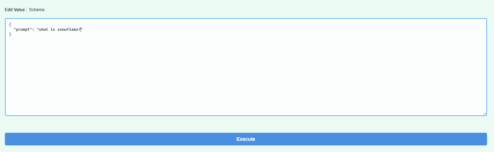
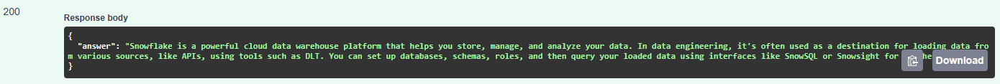
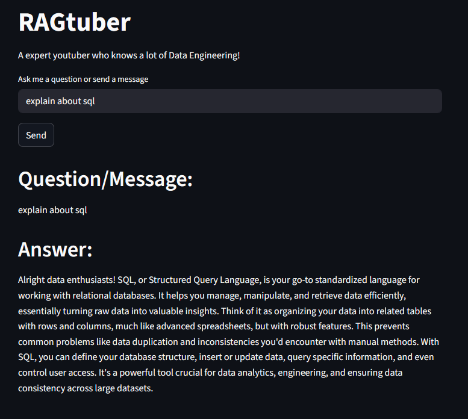

# RAG lab - The Youtuber

This project is about to create a RAG chatbot that answer questions about Data Engineering based on the youtuber transcripts who teaches Data Engineering. This project uses PydanticAI, LanceDB, FastAPI & Streamlit.

It allows you to:

- Ingest the transcripts into a vector database in LanceDB. 
- Query the knowledge base to a FastAPI backend
- Interact with an Agent based on the knowledge base though the FastAPI backend in a Streamlit frontend making questions or sending messages. 
  
The goal with this project is to improve the learning experience by using the provided transcripts content.

# 1. Setup

- Run this command to initialize project and activate your virtual environment.
      
      - uv init 
      - source .venv/Scripts/activate
      - uv add "package_name"
        example: uv add streamlit

- Log in to Google AI Studio to generate your Gemini-API key
  
(https://aistudio.google.com/)

- After getting your API-key, create a .env file to save your credentials (Your Gemini-API key)
  
        GOOGLE_API_KEY=<your_generated_api_key>

- IMPORTANT! The .env file should be gitignored, add in gitignore your .env, otherwise it will leak your credentials in GitHub.        

# 2. Ingesting data to LanceDB

- From your folder project, run ingestion.py to ingest the video transcripts to a vector database. 
        
        uv run ingestion.py

# 3. Test your FastAPI backend 

- Run api.py to start the FastAPI backend to test.
    
        uv run uvicorn api:app --reload
        
- Open docs: 
  
        http://127.0.0.1:8000/docs         

- Try out some questions or messages, this is the answer you will get.

# 4. Opening frontend app in Streamlit 

- Run in the frontend folder from your project your Streamlit frontend app to the interacte with the RAGtuber chatbot. 

        cd frontend
        uv run streamlit run app.py

A insight how it looks 

